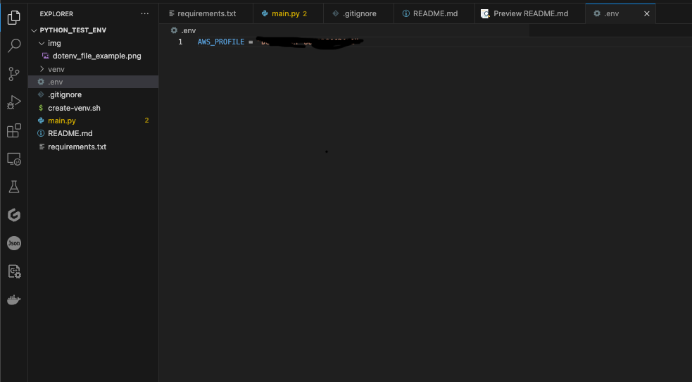

# Python Demo Environment for Skillwell etc

## How to run python projects
This is how you  can run python code on your computer. I am documenting what is needed, and what is contained in this git.

1. Install Python
2. To have a isolated environment for each project, make a virtual environment.
    - in the parent directory (where the README.md is), run `python -m venv venv`
        - This runs the python module venv, which means virtual environment.
    - run `source venv/bin/Activate` to activate the virtual environment. In your CMD/Terminal you should see (venv) to indicate the venv is activated. To deactivate run `deactivate`.
    - You still don't have all the required packages, so to get those run `pip install -r requirements.txt`.
        - This install all the packages specified inside the `requirements.txt`file, and is common place inside python venv's. If you want to get all the packages you have installed in your development to the `requirements.txt`, run `pip freeze > requirements.txt`
    - Now you should be able to run `main.py`file without problems.

To make this easier, I've made a `create-venv.sh`script.

## Useful packages to know

1. boto3
    - this is the AWS Software Development Kit, which is used to interact with AWS Resources and Services, like S3 or Bedrock. [Link to boto3](https://boto3.amazonaws.com/v1/documentation/api/latest/guide/quickstart.html).
2. python-dotenv
    - This is a local "secret" manager. You can define environment values inside a .env file, like API-keys or AWS Profiles, and if you have the correct `.gitignore` file, they will never end up in your repo (example of a good `.gitignore` is in this repo). There is an example on how to use it inside the main.py.

3. langchain
    - Framework to access different Machine Learning Modules. [More information here](https://python.langchain.com/docs/get_started/introduction).